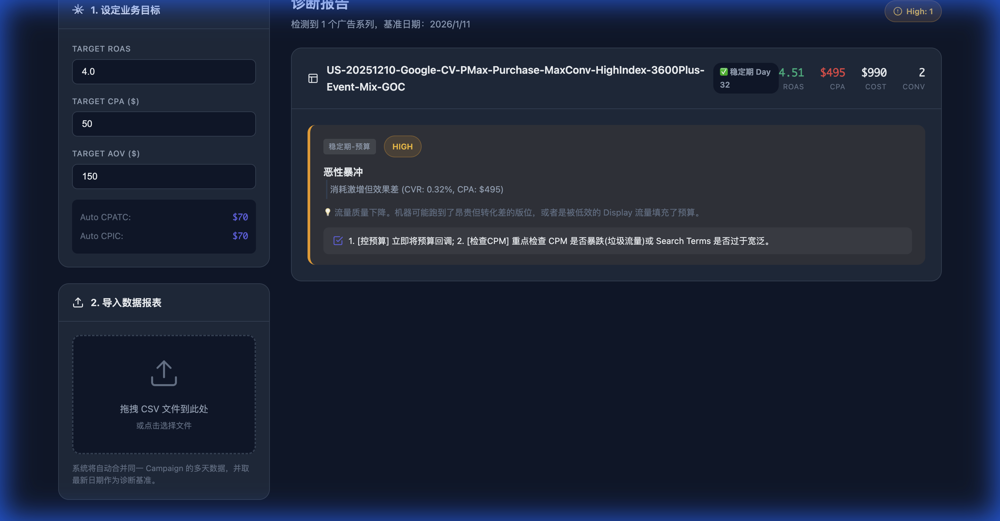

# Pmax 智能诊断专家 Pro

一个专业的 Google Performance Max (Pmax) 广告系列智能诊断工具,基于完整的业务调优逻辑,提供深度诊断和优化建议。



## ✨ 核心功能

### 1. 智能诊断系统
- **基建诊断**: GMC 状态、Policy 状态、消耗骤降检测
- **学习期诊断**: 预算监控、浅/中/深层交互异常检测
- **稳定期诊断**: 消耗优化、CVR 异常分析、CPM 深度分析
- **ROI 深度诊断**: 零转化风险、极高 CPA 熔断、Dead Campaign 检测

### 2. 触发条件可视化
- 每个诊断建议都包含详细的触发条件
- 可折叠的条件详情面板
- 清晰的判断路径展示
- 实际值 vs 阈值对比

### 3. 数据聚合引擎
- 自动合并多天 CSV 数据
- 智能计算汇总指标 (ROAS, CPA, AOV, CVR, CTR)
- 支持历史对比分析

### 4. 灵活配置
- 自定义 Target ROAS、CPA、AOV
- 自动计算 CPATC/CPIC 基准
- 重新诊断功能 (修改参数后无需重新上传数据)

## 🚀 快速开始

### 本地运行

1. **克隆项目**
```bash
git clone https://github.com/your-username/pmax-diagnostic-tool.git
cd pmax-diagnostic-tool
```

2. **启动本地服务器**
```bash
python3 -m http.server 8000
```

3. **打开浏览器**
```
http://localhost:8000/pmax-analyzer.html
```

### 使用演示数据

点击页面右上角的 **"加载演示数据"** 按钮即可查看示例诊断报告。

### 导入自己的数据

1. 从 Google Ads 导出 Pmax 广告系列的 CSV 报表
2. 确保包含以下字段:
   - Campaign, Day, Budget, Cost, Clicks, Impr., Purchase, 销售额, ATC, IC, CPM, CPC, CTR, CVR 等
3. 拖拽 CSV 文件到上传区域或点击选择文件

## 📊 诊断场景覆盖

### Phase 1: 核心场景 (P0/CRITICAL)
- ✅ 基建诊断增强 (Policy Status + 消耗骤降)
- ✅ 中层交互异常 (CPATC/CPIC 超标)
- ✅ 深层交互异常 (高意向零转化)
- ✅ CVR 异常 - 临门一脚
- ✅ CPM 下降诊断
- ✅ 学习期转化成本极高 (3x CPA)
- ✅ 稳定期零转化 (Dead Campaign)

### Phase 2: 高价值场景 (HIGH)
- ✅ 稳定期消耗优化 (良性抢量/高效率/低效能)
- ✅ CPM 深度分析 (CPM 上涨 + CVR 变化)
- ✅ ROI 精细化 (配件陷阱、CPA 正常但 AOV 过低)

**总计**: 28+ 诊断场景

## 📁 项目结构

```
pmax-diagnostic-tool/
├── pmax-analyzer.html          # 主应用文件
├── ggpmax.html                  # 备用版本
├── Pmax数据11.csv              # 示例数据
├── 业务调优思路.md             # 业务逻辑参考文档
├── Pmax调优思路-Ver2.pdf       # PDF 版本
├── docs/                        # 文档目录
│   ├── Pmax调优诊断逻辑规则文档.md
│   ├── walkthrough.md           # 开发总结
│   └── 数据汇总计算逻辑说明.md
├── screenshots/                 # 截图目录
│   └── demo-result.png
├── .agent/                      # Antigravity workflows
│   └── workflows/
│       └── explain-only.md
└── README.md
```

## 🎯 技术特性

- **纯前端实现**: 无需后端,数据完全本地处理
- **现代化 UI**: 深色主题,渐变设计,流畅动画
- **响应式布局**: 适配不同屏幕尺寸
- **CSV 解析**: 智能处理引号、逗号等特殊字符
- **数据持久化**: 支持重新诊断而无需重新上传

## 📖 文档

- [完整诊断逻辑规则](docs/Pmax调优诊断逻辑规则文档.md)
- [数据汇总计算说明](docs/数据汇总计算逻辑说明.md)
- [开发总结](docs/walkthrough.md)

## 🔧 配置参数

| 参数 | 默认值 | 说明 |
|------|--------|------|
| Target ROAS | 4.0 | 目标广告支出回报率 |
| Target CPA | $50 | 目标单次转化成本 |
| Target AOV | $150 | 目标客单价 |
| Auto CPATC | $70 | 自动计算的加购成本基准 |
| Auto CPIC | $70 | 自动计算的结账成本基准 |

## 🤝 贡献

欢迎提交 Issue 和 Pull Request!

## 📄 许可证

MIT License

## 👨‍💻 作者

开发于 2026-01-15

---

**注意**: 本工具仅供参考,实际优化决策请结合业务实际情况。
